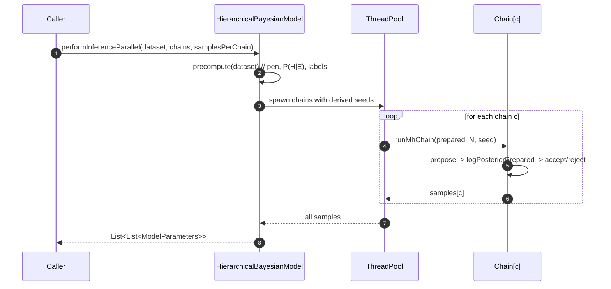

<!--
SPDX-License-Identifier: LicenseRef-Internal-Use-Only
SPDX-FileCopyrightText: 2025 Jumping Quail Solutions
Classification: Confidential — Internal Use Only
-->

# Qualia Architecture and Model Overview

This document gives a high-level view of the `qualia` package: core model flow, samplers, diagnostics, and audit pipeline. It also summarizes the Ψ scoring model used within inference.

## High-level components

```mermaid
graph TD
  subgraph CLI
    CORE[qualia.Core]
  end

  subgraph Model
    HBM[HierarchicalBayesianModel]
    MP[ModelPriors]
    MD[ModelParameters]
    CD[ClaimData]
  end

  subgraph Samplers
    MH[MH (in HBM)]
    RMALA[RmalaSampler]
    HMC[HmcSampler]
  end

  subgraph Diagnostics
    DIAG[Diagnostics]
    STEIN[SteinEstimator\nSteinGradLogP]
  end

  subgraph Audit
    TRAIL[AuditTrail]
    SINKS[Console/File/HTTP/JDBC]
  end

  subgraph Security
    SEC[SecureJsonSerializer\nCrypto]
  end

  CORE -->|runStein / runRmala / demos| HBM
  HBM -->|calculatePsi / logPosterior| MH
  HBM --> RMALA
  HBM --> HMC
  MH --> DIAG
  RMALA --> DIAG
  HMC --> DIAG
  DIAG --> CORE
  HBM --> TRAIL
  TRAIL --> SINKS
  SEC -.-> TRAIL
  MP -. configs .-> HBM
  CD -. dataset .-> HBM
  MD -. samples .-> DIAG
  STEIN --- DIAG
```

Key points:
- `HierarchicalBayesianModel` hosts scoring (Ψ), likelihoods, and a minimal MH prototype. Additional samplers (RMALA, HMC) integrate via the same `logPosterior`.
- `Diagnostics` aggregates multi-chain runs, while `SteinEstimator` offers variance-reduction estimates on functionals of samples.
- `AuditTrail` writes structured records via pluggable sinks (console, file, HTTP, JDBC). `SecureJsonSerializer` and `Crypto` support integrity/confidentiality.

## Inference pipeline (parallel chains)



Implementation notes:
- Precomputation avoids recomputing `pen = exp(-[λ1 Ra + λ2 Rv])` and `P(H|E)` per-iteration.
- Large datasets switch to parallel reduction for likelihood sums.
- Per-chain seeds are generated as `baseSeed + c * 0x9E3779B97F4A7C15` to avoid collisions.

## Ψ scoring model (summary)

Let \(S,N\in[0,1]\) be internal/canonical signals, \(\alpha\in[0,1]\) allocation, risks \(r=(R_a,R_v)\ge 0\) with weights \((\lambda_1,\lambda_2)>0\), and uplift \(\beta\ge 1\).

\[\begin{aligned}
O(\alpha) &= \alpha S + (1-\alpha)N,\\
\operatorname{pen}(r) &= e^{-(\lambda_1 R_a + \lambda_2 R_v)},\\
\Psi &= \min\{\beta\,O(\alpha)\,\operatorname{pen}(r),\,1\}.
\end{aligned}\]

Properties (sub-cap):
- Monotonic: \(\partial\Psi/\partial\alpha = (S-N)\,\beta\,\operatorname{pen}\), \(\partial\Psi/\partial R_a = -\beta O \lambda_1 \operatorname{pen}\), \(\partial\Psi/\partial R_v = -\beta O \lambda_2 \operatorname{pen}\).
- Threshold transfer: if \(\beta\to\beta'\), preserve decisions with \(\tau' = \tau\,(\beta/\beta')\).
- Gauge freedom: reparameterizations preserving affine+exponential+cap leave \(\Psi\) invariant.

## Minimal configuration tips

- Use explicit seeds for reproducibility; otherwise defaults use `ThreadLocalRandom`/`SecureRandom`.
- Tune `parallelThreshold` in `HierarchicalBayesianModel(priors, threshold)` based on dataset size.
- Configure audit sinks per environment (file rotation, JDBC credentials, HTTP endpoint with retries).


